# Ruby on Rails 8 のための Cursor ルール

このディレクトリには、Ruby on Rails 8 アプリケーション開発のためのCursorルールが含まれています。これらのルールは、Rails 8のベストプラクティスに準拠したコーディングをサポートするために設計されています。

## 含まれるルールファイル

1. **rails_rules.json** - Rails 8のコーディング規約とベストプラクティスに関するルール
2. **rails_directory_structure.json** - Rails 8の標準的なディレクトリ構造とファイル配置に関するルール

## ルールの内容

### rails_rules.json

以下のカテゴリのルールが含まれています：

- 命名規則（コントローラー、モデル、テストファイル）
- コーディングスタイル（インデント、文字列リテラル）
- アーキテクチャ上のベストプラクティス（Fat Modelの防止、トランザクションの使用）
- セキュリティのベストプラクティス（Strong Parametersの使用）
- 国際化（i18n）の使用
- ルーティングのネスト制限
- Rails 8特有の機能（Propshaft、SolidCache、SolidQueue、Hotwire）の活用
- ViewComponentの使用
- 並列テストの実装
- Zeitwerk自動読み込みの活用

### rails_directory_structure.json

Rails 8の標準的なディレクトリ構造に関するルールが含まれています：

- モデル、コントローラー、ビューなどの基本ファイルの配置
- サービスオブジェクト、クエリオブジェクト、フォームオブジェクトなどの配置
- ViewComponentの配置
- Hotwire（Turbo、Stimulus）関連ファイルの配置
- APIコントローラーの配置
- Propshaftアセットの配置
- ローカライゼーションファイルの配置

## Rails 8の主な特徴

Rails 8では以下の新機能や変更点があります：

- **Propshaft**: 新しいアセットパイプライン
- **SolidCache**: データベースバックのキャッシュストア
- **SolidQueue**: Active Jobのデータベースバックのアダプター
- **Zeitwerk**: デフォルトの自動読み込みシステム
- **Hotwire**: Turbo、Stimulusを活用したモダンなフロントエンド開発
- **ViewComponent**: コンポーネントベースのUIデザイン
- **Ruby 3.x対応**: 最新のRuby言語機能をサポート
- **並列テスト**: 効率的なテスト実行

## 使用方法

Cursorがこれらのルールを自動的に適用し、コーディング時に適切な警告やサジェスチョンを表示します。

## カスタマイズ

プロジェクト固有のニーズに合わせてルールをカスタマイズする場合は、各JSONファイルを編集してください。

---

これらのルールはRuby on Rails 8のベストプラクティスに基づいていますが、プロジェクト固有の要件に応じて調整することをお勧めします。

## データベース設計

以下は、お酒の情報を管理するためのデータベース設計です。mermaid形式で表現しています。

**補足:**

*   **`store_types` テーブル:** 店舗の種類（例: "居酒屋", "バー", "酒屋（小売）" など）を管理します。`stores`テーブルの`store_type_id`カラムでこのテーブルを参照し、各店舗がどの種類に属するかを示します。これにより、店舗の分類や検索が容易になります。

```mermaid
erDiagram
    companies ||--o{ brands : "has many"
    companies ||--o{ company_status_histories : "has many"
    brands ||--o{ products : "含む"
    products ||--o{ shopping_links : "の購入リンク"
    products ||--o{ product_categories : "属するカテゴリ"
    products ||--o{ product_tags : "持つタグ"
    products ||--o{ store_products : "取り扱い店舗"

    shopping_platforms ||--o{ shopping_links : "has many"
    store_types ||--o{ stores : "has many"
    stores ||--o{ store_products : "has many"

    categories ||--o{ product_categories : "has many"
    tags ||--o{ product_tags : "has many"

    store_operators ||--o{ stores : "運営する"

    brands }o..o{ reviews : "関連レビュー (polymorphic)"
    products }o..o{ reviews : "関連レビュー (polymorphic)"
    stores }o..o{ reviews : "店舗レビュー (polymorphic)"

    companies }o..o{ related_media : "関連メディア (polymorphic)"
    brands }o..o{ related_media : "関連メディア (polymorphic)"
    products }o..o{ related_media : "関連メディア (polymorphic)"
    stores }o..o{ related_media : "関連メディア (polymorphic)"
    store_operators }o..o{ related_media : "関連メディア (polymorphic)"
    related_media }o..o{ web_articles : "メディア詳細 (WebArticle)"
    related_media }o..o{ books : "メディア詳細 (Book)"
    related_media }o..o{ videos : "メディア詳細 (Video)"

    companies }o..o| addresses : "has one (polymorphic)"
    stores }o..o| addresses : "has one (polymorphic)"
    store_operators }o..o| addresses : "has one (polymorphic)"

    companies }o..o{ contacts : "has many (polymorphic)"
    stores }o..o{ contacts : "has many (polymorphic)"
    store_operators }o..o{ contacts : "has many (polymorphic)"

    addresses ||--o| google_maps : "has one"

    companies {
        bigint id PK
        string public_id UK
        string name
        string kana
        string name_en
        text detail
        datetime created_at
        datetime updated_at
    }

    brands {
        bigint id PK
        string public_id UK
        string name
        string kana
        string name_en
        text detail
        bigint company_id FK "会社ID (companies.id)"
        datetime created_at
        datetime updated_at
    }

    products {
        bigint id PK
        bigint brand_id FK "ブランドID (brands.id)"
        string public_id UK
        string name "製品名"
        string name_en
        text detail
        integer volume_ml "容量(ml)"
        float alcohol_percentage "度数(%)"
        string jan_code "JANコード"
        date release_date "発売日"
        boolean is_limited_edition "限定品フラグ"
        boolean is_active "販売中フラグ"
        datetime created_at
        datetime updated_at
    }

    company_status_histories {
        bigint id PK
        bigint company_id FK "会社ID (companies.id)"
        integer event_type
        integer business_status
        integer previous_business_status
        date occurred_on
        text note
        string founder_name
        bigint successor_company_id
        string successor_company_name
        datetime created_at
        datetime updated_at
    }

    google_maps {
        bigint id PK
        bigint address_id FK "住所ID (addresses.id)"
        float latitude
        float longitude
        datetime created_at
        datetime updated_at
    }

    web_articles {
        bigint id PK
        string title
        string url UK
        text description
        string image_url
        date published_at
        datetime created_at
        datetime updated_at
    }

    books {
        bigint id PK
        string title
        string subtitle
        string author
        string publisher
        string isbn UK
        text description
        string cover_image_url
        date published_date
        integer page_count
        string book_type "書籍種別 (book, magazine, mangaなど)"
        datetime created_at
        datetime updated_at
    }

    videos {
        bigint id PK
        string title
        text description
        string thumbnail_url
        string platform "プラットフォーム (youtube, netflixなど)"
        string platform_url UK
        string video_type "動画種別 (movie, drama, youtubeなど)"
        string director
        text cast
        integer duration_minutes
        date release_date
        datetime created_at
        datetime updated_at
    }

    related_media {
        bigint id PK
        string relatable_type "関連元タイプ (Company, Brand, Product, Store, StoreOperatorなど)"
        bigint relatable_id "関連元ID"
        string medium_type "メディアタイプ (WebArticle, Book, Video)"
        bigint medium_id "メディアID"
        datetime created_at
        datetime updated_at
    }

    shopping_platforms {
        bigint id PK
        string name
        string code
        string base_url
        datetime created_at
        datetime updated_at
    }

    shopping_links {
        bigint id PK
        bigint product_id FK "製品ID (products.id)"
        bigint shopping_platform_id FK
        string product_id "プラットフォーム製品ID"
        string url
        decimal price
        boolean is_active
        datetime created_at
        datetime updated_at
    }

    store_types {
        bigint id PK
        string name
        string code
        datetime created_at
        datetime updated_at
    }

    stores {
        bigint id PK
        string name "店舗名"
        string kana
        text description
        string business_hours
        bigint store_type_id FK
        bigint store_operator_id FK "運営会社ID (store_operators.id)"
        boolean is_active
        datetime created_at
        datetime updated_at
    }

    store_products {
        bigint id PK
        bigint store_id FK
        bigint product_id FK "製品ID (products.id)"
        boolean is_featured
        datetime created_at
        datetime updated_at
    }

    reviews {
        bigint id PK
        string reviewable_type "レビュー対象タイプ (Brand, Product, Store)"
        bigint reviewable_id "レビュー対象ID"
        string title
        text content
        integer rating
        string reviewer_name
        boolean is_verified
        datetime created_at
        datetime updated_at
    }

    categories {
        bigint id PK
        string name
        string code
        text description
        datetime created_at
        datetime updated_at
    }

    tags {
        bigint id PK
        string name
        datetime created_at
        datetime updated_at
    }

    product_categories {
        bigint id PK
        bigint product_id FK "製品ID (products.id)"
        bigint category_id FK
        datetime created_at
        datetime updated_at
    }

    product_tags {
        bigint id PK
        bigint product_id FK "製品ID (products.id)"
        bigint tag_id FK
        datetime created_at
        datetime updated_at
    }

    store_operators {
        bigint id PK
        string public_id UK
        string name "店舗運営会社名"
        string kana "ふりがな"
        string corporate_number "法人番号"
        text detail "会社概要"
        datetime created_at
        datetime updated_at
    }

    addresses {
        bigint id PK
        string addressable_type "関連タイプ (Company, Store, StoreOperatorなど)"
        bigint addressable_id "関連ID"
        string zip_code "郵便番号"
        integer prefecture_code "都道府県コード"
        string city "市区町村"
        string street_address "番地など"
        string building_name "建物名など"
        datetime created_at
        datetime updated_at
    }

    contacts {
        bigint id PK
        string contactable_type "関連タイプ (Company, Store, StoreOperatorなど)"
        bigint contactable_id "関連ID"
        string tel "電話番号"
        string fax "FAX番号"
        string website "HP URL"
        string email "メールアドレス"
        string instagram "Instagramアカウント"
        string twitter "Twitterアカウント"
        string facebook "Facebookページ"
        string line "LINE公式アカウント"
        datetime created_at
        datetime updated_at
    }
```

このデータベース設計は、お酒に関する様々な情報を管理することを目的としており、主に以下の要素で構成されています。

**主要なエンティティ（情報の中核となるテーブル）:**

1.  **`companies`**: お酒の製造会社（酒蔵など）を表します。住所情報は`addresses`テーブル、連絡先情報は`contacts`テーブルを参照します。
2.  **`brands`**: 特定の会社（`companies`）が製造するお酒の銘柄ファミリー（例: 「獺祭」）を表します。
3.  **`products`**: 特定のブランド（`brands`）に属する具体的な製品ラインナップ（例: 「獺祭 純米大吟醸 磨き二割三分 720ml」）を表します。容量、度数などの詳細情報も持ちます。購入リンク、カテゴリ/タグ付け、店舗での取り扱いの主な対象となります。
4.  **`stores`**: お酒を取り扱う店舗（飲食店、酒屋など）を表します。住所情報は`addresses`テーブル、連絡先情報は`contacts`テーブルを参照します。
5.  **`store_operators`**: 店舗（`stores`）を運営する会社を表します。住所情報は`addresses`テーブル、連絡先情報は`contacts`テーブルを参照します。
6.  **`reviews`**: ブランド（`brands`）、製品（`products`）、店舗（`stores`）に対するユーザーレビューを表します。ポリモーフィック関連（`reviewable`）により、レビュー対象を指定します。

**関連・分類・補助テーブル:**

*   **`web_articles`**: Web記事の情報を格納します。
*   **`books`**: 書籍、雑誌、漫画などの情報を格納します。
*   **`videos`**: 動画（映画、ドラマ、YouTube動画など）の情報を格納します。主に外部プラットフォームへのリンクやサムネイル情報を保持します。
*   **`related_media`**: 主要エンティティ（`companies`, `brands`, `products`, `stores`, `store_operators`）と、各種メディアテーブル（`web_articles`, `books`, `videos`）をポリモーフィックに紐付ける中間テーブルです。
*   **`addresses`**: 住所情報を管理するテーブル。ポリモーフィック関連（`addressable`）により、`companies`, `stores`, `store_operators` など様々なエンティティの住所情報を一元管理します。
*   **`google_maps`**: 住所（`addresses`）に対応する地図情報（緯度経度）を管理します。`addresses`テーブルと1対1の関係を持ちます。
*   **`contacts`**: 連絡先情報（電話番号、FAX、HP、メールアドレスなど）を管理するテーブル。ポリモーフィック関連（`contactable`）により、`companies`, `stores`, `store_operators` など様々なエンティティの連絡先情報を一元管理します。
*   **`company_status_histories`**: 会社（`companies`）のステータス変更履歴を管理します。
*   **`shopping_platforms`**: 購入可能なECサイト（例: "Amazon", "楽天"）を定義します。
*   **`shopping_links`**: 製品（`products`）を特定のECサイト（`shopping_platforms`）で購入するためのリンク情報（URL、価格など）を管理します。
*   **`store_types`**: 店舗（`stores`）の種類（例: "居酒屋", "酒屋"）を定義します。
*   **`store_products`**: 店舗（`stores`）と製品（`products`）の間の多対多関係を管理し、どの店舗でどの製品が取り扱われているかを示します。
*   **`categories`**: 製品（`products`）を分類するための、比較的固定的なカテゴリ（例: "日本酒", "純米酒"）を定義します。
*   **`product_categories`**: 製品（`products`）とカテゴリ（`categories`）の間の多対多関係を管理します。
*   **`tags`**: 製品（`products`）を特徴付けるための、より自由なキーワード（例: "辛口", "限定品"）を定義します。
*   **`product_tags`**: 製品（`products`）とタグ（`tags`）の間の多対多関係を管理します。

この設計により、お酒の「ブランド」とその中の具体的な「製品」を明確に区別し、製品ごとにレビュー、価格、取り扱い店舗、カテゴリ、タグなどの情報を正確に紐付けて管理することが可能になります。また、レビューをブランド全体、製品個別、そして店舗に対しても行うことができます。Web記事、書籍、動画といった多様なメディア情報も、それぞれの特性に応じたテーブルで管理しつつ、主要なエンティティに柔軟に関連付けることができます。住所情報や連絡先情報も一元管理され、関連するエンティティと紐付けられます。
